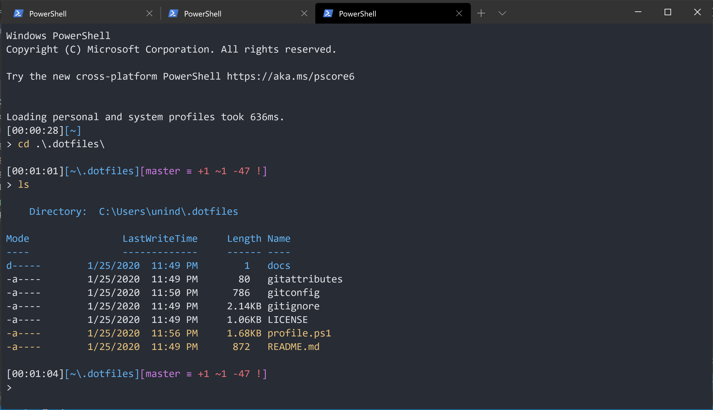

# Dotfiles (Windows)

These are my dotfiles. There are many like them, but these are mine.



## Prerequisites

Before installing, make sure the following prerequisites have been met.

1. Windows PowerShell 5.x or PowerShell Core 6.0. You can get PowerShell Core 6.0 for Windows, Linux or macOS from <https://aka.ms/pscore6>. Check your PowerShell version by running `$PSVersionTable.PSVersion`.
2. On Windows, script execution policy must be set to either `RemoteSigned` or `Unrestricted`. Check the script execution policy setting by running `Get-ExecutionPolicy`. If the policy is not set to one of the two required values, run `Set-ExecutionPolicy RemoteSigned -Scope CurrentUser -Confirm` as administrator.
3. Git must be installed and available via the `PATH` environment variable. Check that `git` is accessible from PowerShell by running `git --version`.

## Installation

Clone this repo into your home directory as `.dotfiles` and run the `install.ps1` script as administrator:

```sh
$ git clone git://github.com/unindented/dotfiles-windows.git ~/.dotfiles
$ cd ~/.dotfiles
$ ./install.ps1
```

It will symlink the appropriate files in `.dotfiles` to their corresponding directories.

## Meta

- Code: `git clone git://github.com/unindented/dotfiles-windows.git`
- Home: <https://github.com/unindented/dotfiles-windows/>

## Contributors

Daniel Perez Alvarez ([unindented@gmail.com](mailto:unindented@gmail.com))

## License

Copyright (c) 2020 Daniel Perez Alvarez ([unindented.org](https://unindented.org/)). This is free software, and may be redistributed under the terms specified in the LICENSE file.
